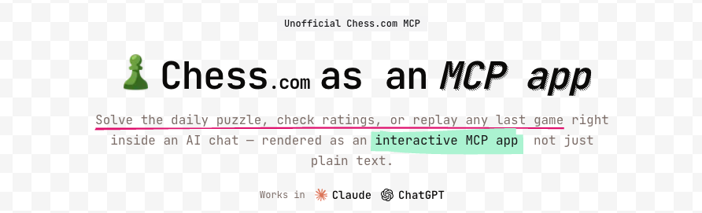

<p align="center">
  
</p>

<p align="center">
  <a href="https://docs.skybridge.tech"></a>
  <a href="https://chess.niklas.sh/"></a>
</p>


## Tools

- **get-chess-player** — Look up a Chess.com player by username and show their profile and game statistics (rapid, blitz, bullet ratings and win/loss records).
- **get-last-game** — Look up a player's most recent game with result, opponent, opening, and an interactive board replay.

## Getting Started

### Prerequisites

- Node.js 24.14.1+
- pnpm 9+

### Local Development

#### 1. Install

```bash
pnpm install
```

#### 2. Start the dev server

```bash
pnpm dev
```

This command starts:
- The MCP server at `http://localhost:3000/mcp`.
- Skybridge DevTools UI at `http://localhost:3000`.

#### 3. Project structure

```
├── src/
│   ├── server.ts         # Server entry point and tool definitions
│   ├── views/            # React components (one per view)
│   ├── components/       # Shared UI components
│   ├── helpers.ts        # Shared utilities
│   └── index.css         # Global styles
├── vite.config.ts
├── Dockerfile
└── package.json
```

### Testing your App

Test the app locally using the DevTools UI at `http://localhost:3000` while running `pnpm dev`.

To connect with web clients like ChatGPT or Claude, expose your server with the `--tunnel` flag (`pnpm dev:tunnel`). See the [test guide](https://docs.skybridge.tech/quickstart/test-your-app).

## Analytics

Tool calls can be tracked with [PostHog](https://posthog.com). Tracking is
wired as MCP middleware in `src/server.ts` and is a **no-op** unless
`POSTHOG_API_KEY` is set, so forks and local development send no events.

Copy `.env.example` to `.env` and set the keys to enable it locally:

```bash
cp .env.example .env
```

Use the PostHog **Project** API Key (`phc_...`), never a Personal API Key. No
key value is ever committed — only read from the environment.

## Deploy

Deployments target **Google Cloud Run** and are driven by SemVer release tags.

### Release flow

1. Land changes on `main` using [Conventional Commits](https://www.conventionalcommits.org/)
   (`feat:` → minor, `fix:` → patch, `feat!:`/`BREAKING CHANGE:` → major).
2. [`release-please`](https://github.com/googleapis/release-please) opens a
   release PR with the version bump and `CHANGELOG.md`.
3. Merging that PR creates a `vX.Y.Z` tag and GitHub Release.
4. The tag triggers `.github/workflows/deploy.yml`, which builds the image,
   pushes it to Artifact Registry (tagged `X.Y.Z` and `latest`), and deploys to
   Cloud Run.

### One-time GCP setup

- Enable APIs: `run`, `cloudbuild`, `artifactregistry`, `iamcredentials`,
  `secretmanager`.
- Create an Artifact Registry Docker repo named `chess-mcp`.
- Set up [Workload Identity Federation](https://github.com/google-github-actions/auth#preferred-direct-workload-identity-federation)
  for GitHub Actions and a service account with roles `run.admin`,
  `artifactregistry.writer`, `iam.serviceAccountUser`, and
  `secretmanager.secretAccessor`.
- Store the PostHog project key in Secret Manager as `posthog-api-key`.

### GitHub configuration

Repository **secrets**: `GCP_PROJECT_ID`, `GCP_WIF_PROVIDER`,
`GCP_SERVICE_ACCOUNT`.

Repository **variables**: `GCP_REGION`, `POSTHOG_HOST` (e.g.
`https://eu.i.posthog.com`).

### Custom domain

Map your domain via Cloud Run (managed TLS is provisioned automatically):

```bash
gcloud run domain-mappings create \
  --service chess-mcp \
  --domain chess.niklas.sh \
  --region "$GCP_REGION"
```

Then add the DNS records that the command prints to your DNS provider.

## Resources

- [Skybridge Documentation](https://docs.skybridge.tech/)
- [Apps SDK Documentation](https://developers.openai.com/apps-sdk)
- [MCP Apps Documentation](https://github.com/modelcontextprotocol/ext-apps/tree/main)
- [Model Context Protocol Documentation](https://modelcontextprotocol.io/)

## License

The source code is released under the [Beerware License](./LICENSE).

The chess piece icons are from the ["Chess" pack on Flaticon](https://www.flaticon.com/packs/chess-75) and are used under the Flaticon Free License — they are not covered by the Beerware license. See [NOTICE](./NOTICE) for details.
